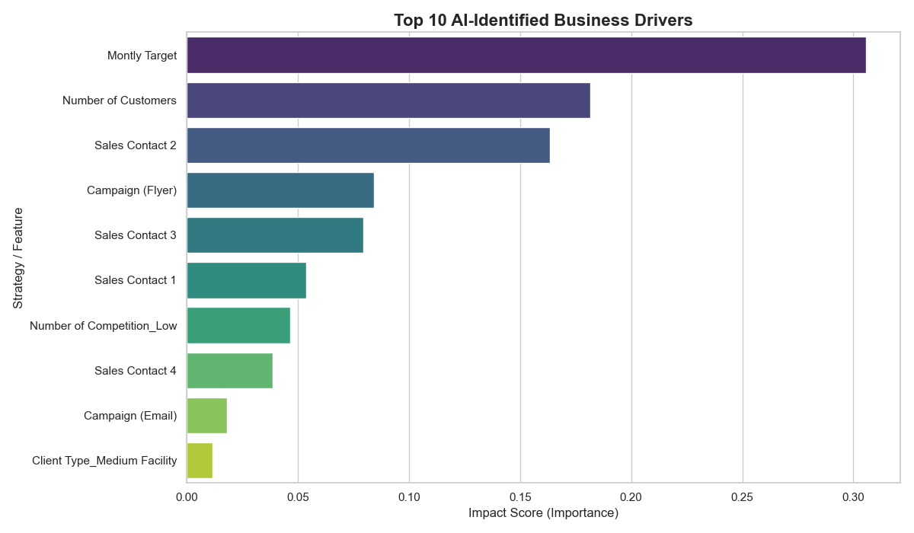
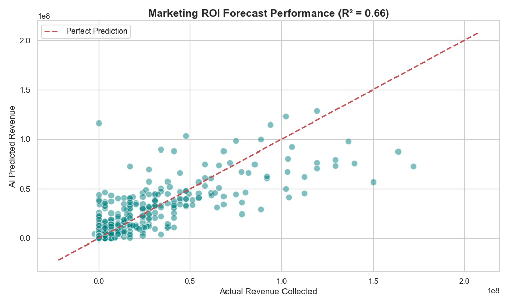
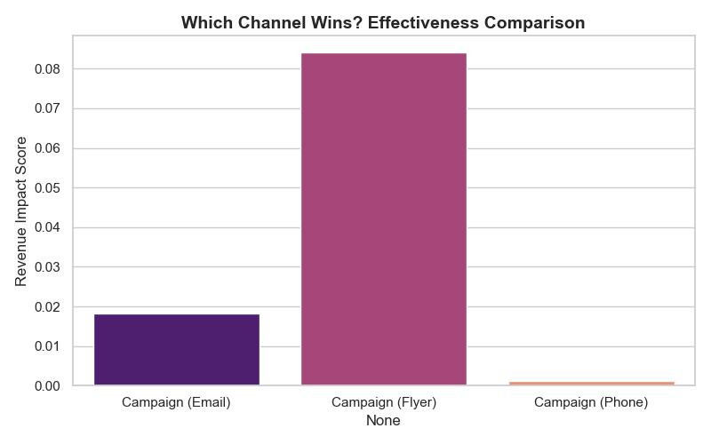

# Marketing-ROI-Campaign-Intelligence-Engine

📊 Marketing ROI & Campaign Intelligence Engine

## 🚀 Project Overview
This project transforms raw marketing campaign data into actionable business intelligence. Using a **Random Forest Regressor**, the system predicts the return on investment (ROI) for various marketing channels and provides a data-driven roadmap for strategic budget allocation.

**Key Objective:** To identify which campaign channels (hsusever@gmail.com, +905335193059) drive the highest revenue while ensuring complete data integrity through a secure processing pipeline.

---

## 🛡️ Security-First Architecture
In alignment with "Data-Centric AI" principles, this project implements a robust defense strategy:
* **Dual-Layer Validation:** A custom `validate_marketing_csv` function ensures that only verified schemas are processed.
* **Sanitization:** Automatic handling of categorical encoding and null-value imputation to prevent model failures.
* **Integrity Checks:** Protection against data type inconsistencies, ensuring the model only trains on verified numerical inputs.

---

## 📈 Strategic Insights & Visualizations

### 1. Top 10 Business Drivers
This analysis identifies the most critical factors influencing revenue. It ranks which sales contacts and strategies have the highest impact on the bottom line.

### 2. AI Prediction Accuracy (Actual vs. Forecast)
Our model achieved an **R² Score of 0.66**, providing a reliable and honest baseline for revenue forecasting. The scatter plot below demonstrates the strong correlation between actual results and AI predictions.

### 3. Campaign Channel Effectiveness
Email, Flyer, or Phone? This visualization reveals the "winner" in the battle for customer engagement, allowing stakeholders to optimize marketing spend.

---

## 🛠️ Technical Stack
* **Language:** Python
* **Data Handling:** Pandas, NumPy
* **AI/ML:** Scikit-Learn (Random Forest)
* **Visualization:** Seaborn, Matplotlib

## 👨‍💻 About the Author
I am a Data Scientist focused on building **reliable, secure, and high-impact** AI systems. I believe that a model is only as strong as its data foundation. Inspired by the methodologies of Andrew Ng, I strive for precision and integrity in every line of code.
